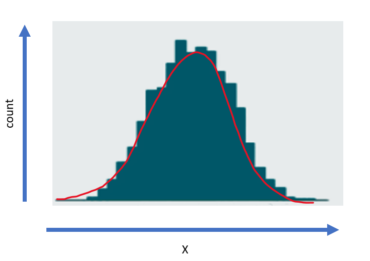
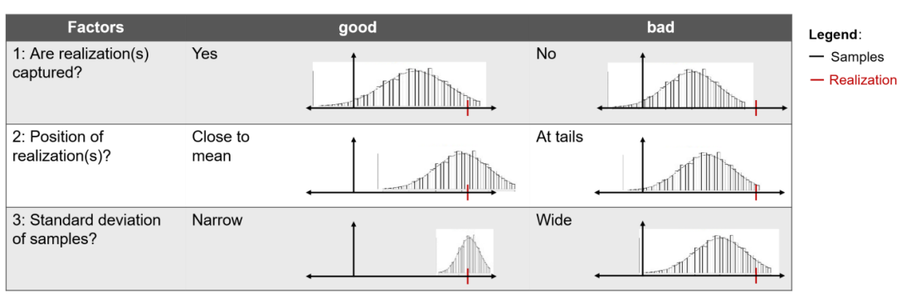
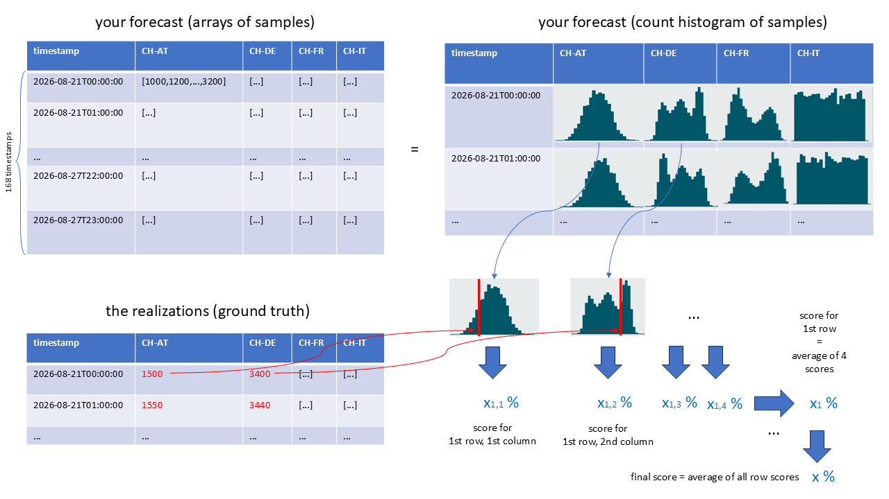

# EDH 2026

Welcome to the 2026 Swissgrid challenge :) You will have to forecast the electricity flows between Switzerland and our dear neighbours!

## What kind of forecast are we talking about?

Your forecast should be a probability distribution, not a single value. Instead, provide an array of samples. These samples form the distribution and can be visualized as a count histogram.

The difference can be seen in the answer to the question "How is quantity X looking like tomorrow?":
- **Point forecast:** one best guess for tomorrow, for example "X will most probably be 10".
- **Probability distribution:** several plausible guesses for tomorrow, for example "X could be 0, 3, 12, 13, 10, ...".

This tells us not only what value is most likely, but also how uncertain that value is. When plotting the guesses (samples) of X by counting them in a histogram, we can see how the probability distribution looks like:



## Submit your forecast

To submit your forecast, follow these three simple steps:

1. Put your predictions in a table with the expected schema. The table must have exactly 5 columns: `timestamp` plus 4 `array<int>` columns. It must also contain exactly 168 rows, and each array must contain exactly 300 non-null integer samples.
2. Import the helper in your Python notebook:

```python
# Import the path
import sys
sys.path.insert(0, '/Workspace/github/dp-light-edh/src')

# Import the function
from edh2026.trigger_submission import submit_prediction_table
```

3. Call `submit_prediction_table` with your schema and table name:

```python
submit_prediction_table(
    schema_name="group_n",
    table_name="my_submission",
    identifier="best_model_ever",
)
```
Where `identifier` is just an arbitrary cute name you give to your submission. If your table has the expected schema (see 1. above), the score is returned directly in the notebook cell where you run the call.

## Score validation data locally

You can use the same scoring function locally to compare predictions with validation realizations that your team can read. This runs entirely on the cluster attached to your notebook: it does not start the official evaluation job, use a submission slot, enforce the 30-minute cooldown, or publish a result.

```python
import sys
sys.path.insert(0, '/Workspace/github/dp-light-edh/src')

from edh2026.local_scoring import score_prediction_table

validation_score = score_prediction_table(
    prediction_table_name="edh.group_n.validation_predictions",
    realizations_table_name="edh.group_n.validation_realizations",
)
print(f"Score: {score}")
```

Both tables must follow the official evaluator's requirements: the predictions table has the submission schema, and the realizations table has `timestamp` plus four realization columns. Unlike an official submission, the validation tables may contain any non-zero number of timestamp-aligned rows. The result is the same raw score returned by an official submission, so the two can be compared directly. Validation scores are only as representative as the validation period; the official score remains the evaluation on unseen test realizations.

## How scoring works

Each forecast distribution is checked with three simple ideas:

- **Capture**: did the realization fall inside the predicted range?
- **Error**: how far is the realization from the predicted mean?
- **Sharpness**: how narrow is the predicted distribution?



Error and sharpness count most (45% and 35%), while capture has a smaller influence (20%) but is necessary (if capture is 0, the 2 other factors are set to 0). The final score is averaged across all rows as follows:



Please note that you can only submit a new evaluation every 30 minutes, so make it count!
Your score will also be published on a dashboard that is visible to all participants :)
